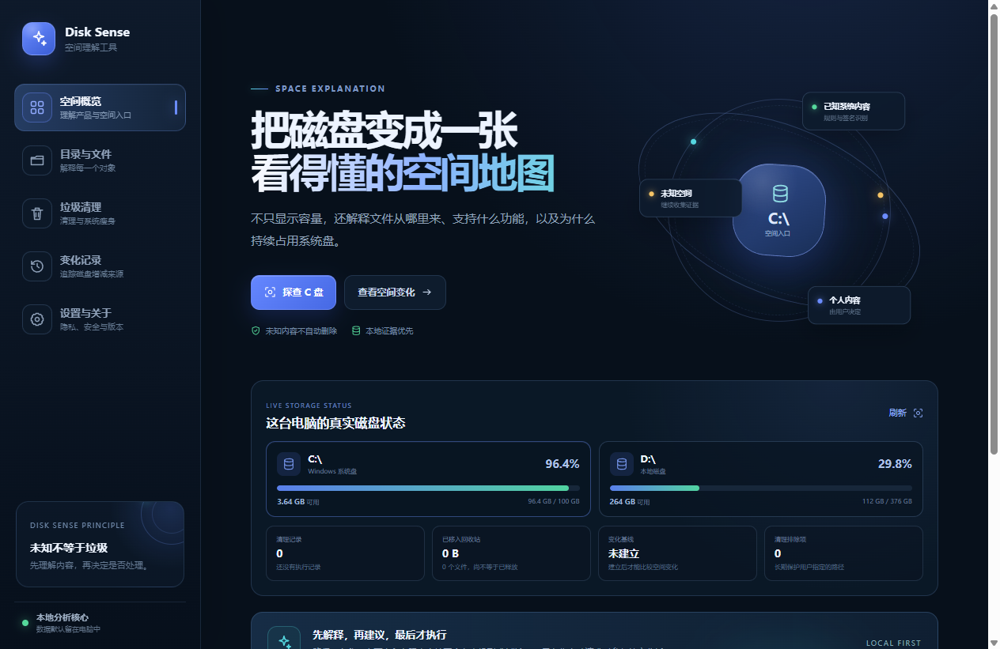
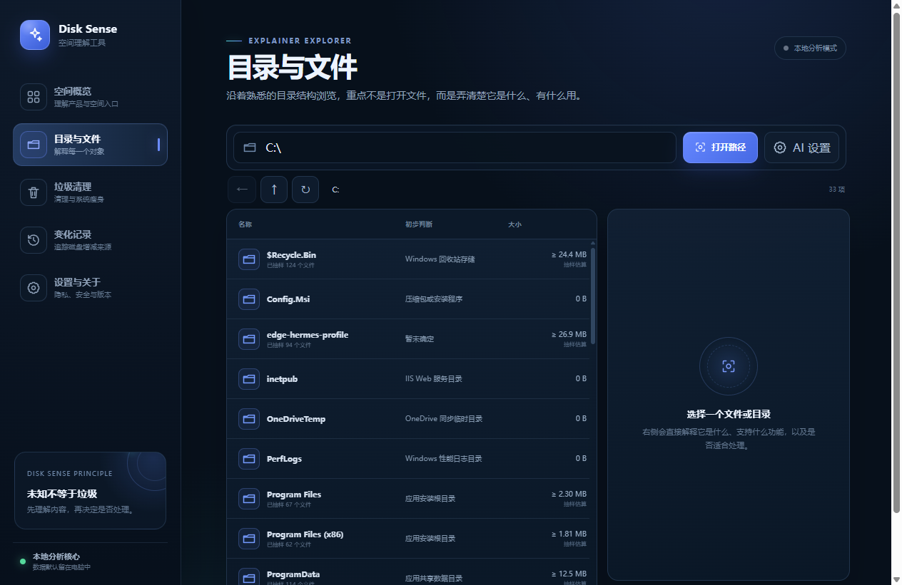
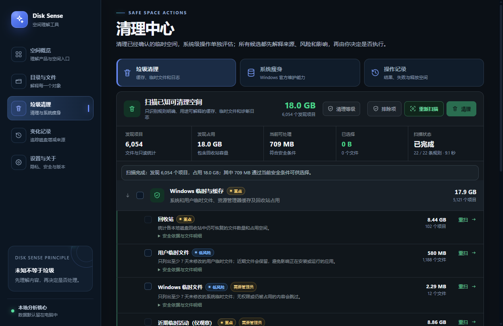
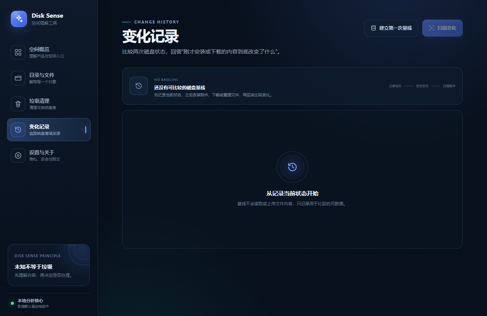
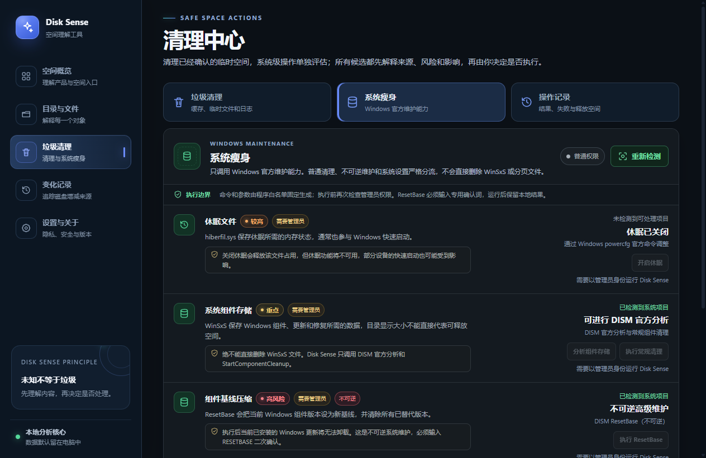

<p align="center">
  
</p>

<h1 align="center">Disk Sense</h1>

<p align="center">
  <strong>先解释空间，再决定处理什么。</strong>
</p>

<p align="center">
  
  
  
  
  
  
</p>

Disk Sense 是一款面向 Windows 的本地优先磁盘空间解释工具。它不仅寻找已知缓存和临时文件，更希望回答三个普通清理软件经常无法回答的问题：

- 这个文件或文件夹究竟是什么，有什么用？
- C 盘空间为什么持续增长，哪些应用在不同磁盘之间产生了数据？
- 哪些内容可以安全处理，哪些内容必须由用户确认？

项目的核心原则是：**可靠地清理已知空间，谨慎地解释未知空间。未知不等于垃圾。**

## 为什么做 Disk Sense

传统清理工具擅长识别固定位置中的缓存和临时文件，但用户自己的文件、遗忘的下载内容、跨盘应用数据和来源不明目录通常不在规则范围内。时间久了，即使反复清理，C 盘仍会重新变满。

Disk Sense 采用“空间解释 + 变化追踪 + 安全清理”的方式：

1. 从 `C:\` 开始，像资源管理器一样浏览目录结构。
2. 结合路径、名称、父级、同级结构、文件特征和有限内容证据判断用途。
3. 记录两次扫描之间新增、减少、变大、变小和移动的内容。
4. 对已知低风险项目提供可预览的清理，对未知和个人内容只提供解释与建议。

## 当前能力

| 模块 | 能力 |
| --- | --- |
| 目录与文件 | 从 `C:\` 浏览文件系统，解释对象是什么、有什么用、可能属于哪个应用，以及处理风险 |
| AI 深入分析 | 支持 OpenAI 兼容接口、自动发现模型、普通/深入两种分析强度，并在当前会话中缓存结果 |
| 变化记录 | 建立多磁盘基线，对比两次扫描之间的新增、删除、大小变化和明确的文件移动 |
| 垃圾清理 | 22 项低风险或仅检测规则，覆盖 Windows、浏览器、应用与开发工具缓存，支持预览、排除项、进程保护、失败明细和清理历史 |
| 系统瘦身 | 检测休眠文件、WinSxS、虚拟内存和 Windows.old；可在明确确认后调用 powercfg、DISM 或打开 Windows 官方设置 |
| 应用归属 | 识别浏览器、通信工具、游戏平台和开发工具在 C/D 盘中的常见数据位置 |
| 风险体系 | 高风险、较高、重点、低风险、安全五级风险，统一使用红、橙、黄、蓝、绿标识 |

## 界面预览

<table>
  <tr>
    <td width="50%"></td>
    <td width="50%"></td>
  </tr>
  <tr>
    <td align="center">空间概览</td>
    <td align="center">目录与文件解释</td>
  </tr>
  <tr>
    <td width="50%"></td>
    <td width="50%"></td>
  </tr>
  <tr>
    <td align="center">垃圾清理</td>
    <td align="center">变化记录</td>
  </tr>
  <tr>
    <td colspan="2"></td>
  </tr>
  <tr>
    <td colspan="2" align="center">系统瘦身与 Windows 官方维护</td>
  </tr>
</table>

## 安全边界

- 默认只移动到 Windows 回收站，不提供永久删除入口。
- 所有批量处理必须先扫描和预览。
- 清理操作只接受当前扫描产生的短期候选标识，不能直接传入任意路径。
- 执行前重新检查路径边界、文件身份、保留时间、进程占用和用户排除项。
- 不跟随符号链接、目录联接或逃逸出扫描根目录的路径。
- 未知内容、个人文件和应用数据不会被自动归类为垃圾。
- 系统维护与普通垃圾清理严格分流，只允许程序内置的 Windows 官方命令和固定参数。
- DISM、休眠调整等操作会再次检查管理员权限并要求输入专用确认词；ResetBase 会明确标记为不可逆。
- Disk Sense 不直接删除 WinSxS、分页文件或 Windows.old；虚拟内存和旧版 Windows 安装交由 Windows 官方设置处理。
- AI 是辅助解释层，不拥有删除权限，也不会替代本地安全规则。

安全问题请参阅 [SECURITY.md](SECURITY.md)。

## 隐私与本地数据

- 扫描、索引、清理历史和用户排除项默认只保存在本机。
- 文件扫描以元数据为主，只有在解释需要时才读取有上限的文件头部内容。
- AI 功能默认关闭；只有用户主动配置并请求分析时才会发送经过裁剪和脱敏的证据。
- API Key 使用 Electron `safeStorage` 调用 Windows 安全能力加密保存。
- 设置页面会显示本地数据目录，并允许用户自行查看。

## 开发运行

### 环境要求

- Windows 10/11 x64
- Node.js 22.12 或更高版本（推荐 Node.js 24）
- pnpm 11

```powershell
corepack enable
corepack prepare pnpm@11.9.0 --activate
pnpm install
pnpm dev:desktop
```

如果系统仍提示无法识别 `pnpm`，可执行 `npm install -g pnpm@11.9.0` 后重新打开 PowerShell。

`pnpm dev:desktop` 会同时启动 Vite 和真实 Electron 桌面应用：

- Vue、TypeScript 和 CSS 修改会在当前窗口热更新。
- `desktop/` 下主进程或 preload 模块变化时，只重启一个 Electron 窗口。
- 真实文件系统、Windows API 和 IPC 功能必须在桌面开发模式中验证，不能用普通网页预览代替。

常用命令：

```powershell
pnpm typecheck          # TypeScript / Vue 类型检查
pnpm test               # 单元、安全和故障注入测试
pnpm check:desktop      # Electron 模块语法检查
pnpm validate           # 完整本地质量检查
pnpm release:win        # 构建 Windows 安装版和便携版
```

## 项目结构

```text
desktop/                Electron 主进程、preload、安全清理与扫描核心
src/                    Vue 3 + TypeScript 用户界面
tests/                  单元、安全边界、状态恢复和性能约束测试
docs/                   产品基础、运维和发布验收文档
.github/workflows/      GitHub Actions 持续集成
```

## 版本状态

当前版本为 **1.0.0 本地发行候选版**。解包版、便携版和安装版已通过桌面冒烟测试及静默安装/卸载验证。

正式公开分发前仍需：

- 使用可信 Authenticode 证书签名安装包和应用程序。
- 在全新的 Windows 虚拟机中完成每个发布标签的安装验证。
- 随发行文件公开 SHA-256 校验值。

详细记录见 [发布检查清单](docs/release-checklist.md) 和 [更新日志](CHANGELOG.md)。

## 许可证

本项目采用 [MIT License](LICENSE)。
